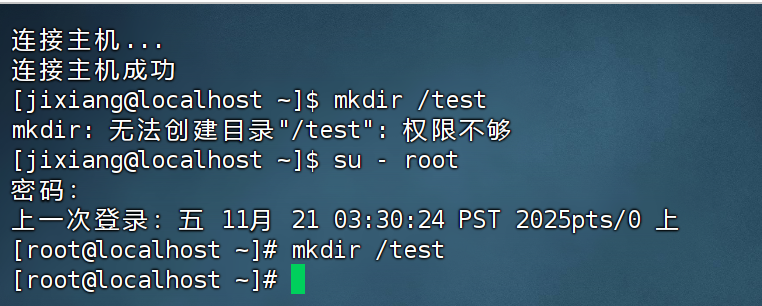
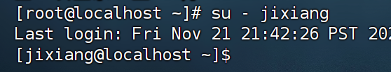
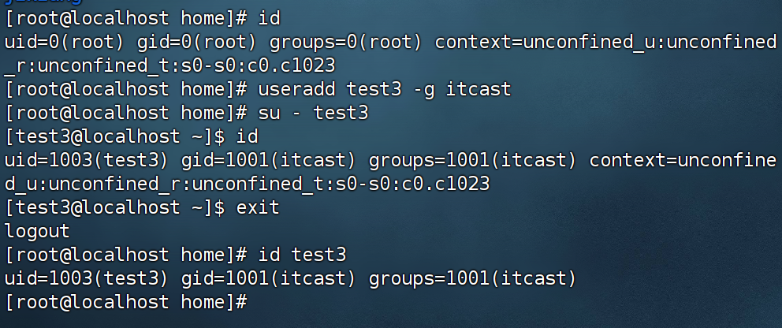
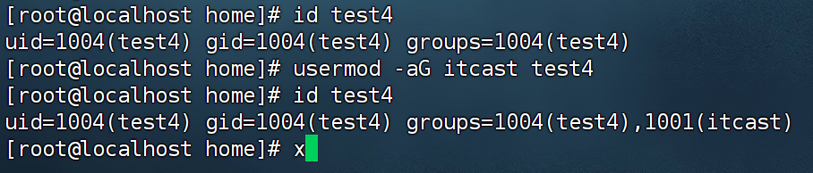
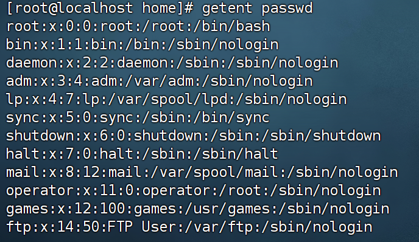
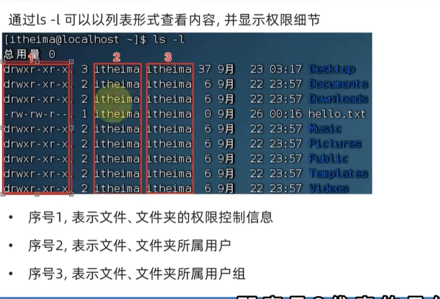
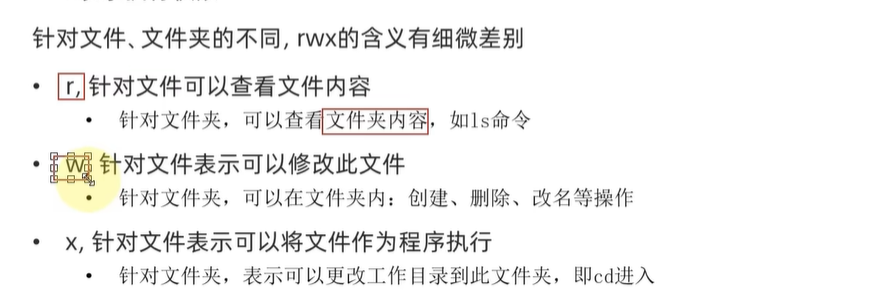
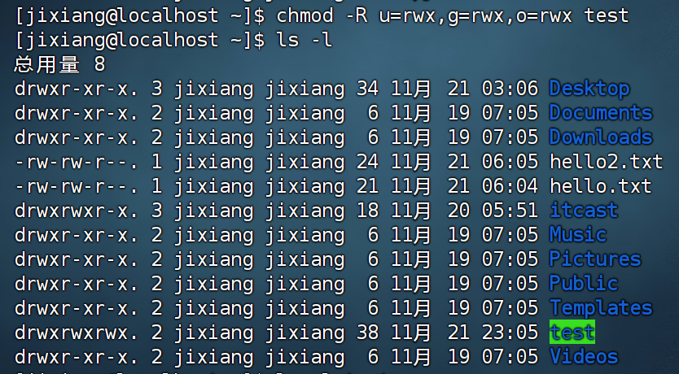
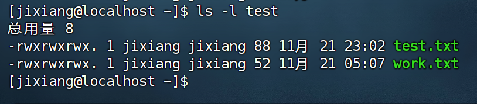
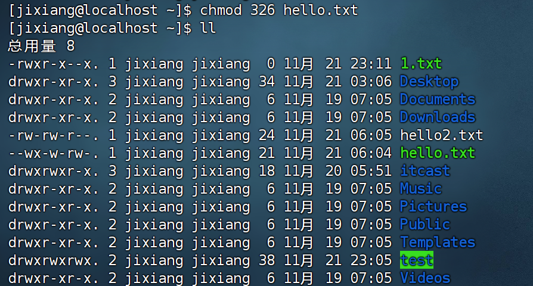

# Linux学习第三章

## 第三章

### 01-Linux的root用户

普通用户无法在根目录下创建文件夹

su - root 切换用户

su 和exit命令

su switch user

#### 1.su - [用户名]

* -符号是可选的，表示是否在切换用户后加载环境变量
* 参数：用户名，表示要切换的用户，用户名也可以省略，省略表示切换到root
* 切换用户后，可以通过exit 命令退回i上一个用户，也可以使用快捷键:ctrl+d

#### 2.sudo命令

不建议长期使用root 用户，避免带来系统损失

可以使用sudo命令，为普通的命令授权，临时以root身份执行

语法：sudo 其他命令

* 并不是所有的用户，都有权利使用sudo，我们需要为普通用户配置sudo认证

为普通用户配置sudo认证

切换到root 用户，执行visudo命令

---

### 02-用户和用户组

Linux中关于权限的管控级别有两个级别，分别是：

* 针对用户的权限控制
* 针对用户组的权限控制

1.用户组管理

* 创建用户组
* groupadd 用户组名
* 删除用户组
* groupdel 用户组名
* 

2.用户管理

 		创建用户

#### 1.useradd [-g -d] 用户名

* 选项：-g指定用户的组，不指定-g,会创建同名组并自动加入，指定-g需要组已经存在，如已存在同名组，必须使用-g
* 选项：-d指定用户HOME路径，不指定，HOME目录默认在：/home/用户名

#### 2.删除用户userdel [-r] 用户名

* 选项-r ,删除用户的HOME目录，不适用-r ,删除用户时，HOME目录保留

* 

  

  查看用户所属组

#### 3.id [用户名]

* 参数：用户名，被查看的用户，如果不提供则查看自身

  

  

  修改用户所属组X

#### 4.usermod -aG 用户组 用户名

* 将指定用户加入指定用户组

  

#### 5.getent

可以查看当前系统中有哪些用户

语法：getent passwd

共有7份信息,分别是：

用户名：密码(x):用户ID:组ID:描述信息(无用):HOME目录：执行终端（默认bash)

同样可以查看当前系统中有哪些用户组

语法：getent group

包含三份信息：组名称：组认证（显示为x):组ID

---

### 03-查看权限控制信息

认知权限信息

r:read	w:write	x:excute 	读写执行

---

### 04-chmod命令修改权限控制

---

### 05-chown修改权限控制

