# LInux学习第二章

## 第二章

### 10-which-find命令

#### 1.which 命令

查看所使用的一系列命令的程序文件都放在哪里

#### 2.find命令-搜索指定的文件

语法：find 起始路径 -name "被查找文件名"

我们可以切换到root 用户获得管理员其权限

su - root 

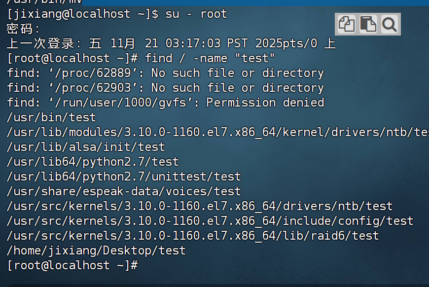

被查找文件名，支持使用通配符*来做模糊查找

* 符号*表示通配符，即匹配任意内容（包含空）

* test*,表示匹配任何以test开头的内容

* *test,表示匹配任何以test结尾的内容

* *test *,表示匹配任何包含test的内容

  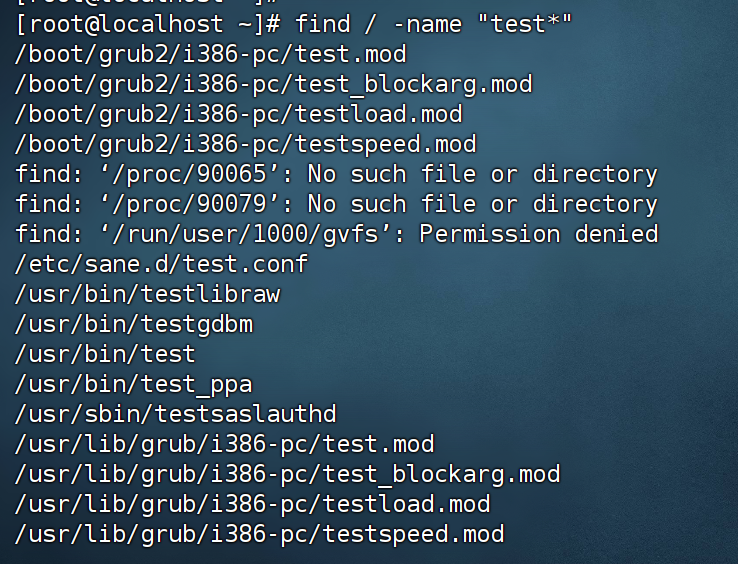

find命令-按文件大小查找文件

语法：find 起始路径 -size +|-n[kMG]

* +、-表示大于和小于
* n表示大小数字
* kMG表示大小单位，k(小写字母)表示KB,M表示MB,G表示GB

示例：

* 查找小于10KB的文件：find / -size -10k

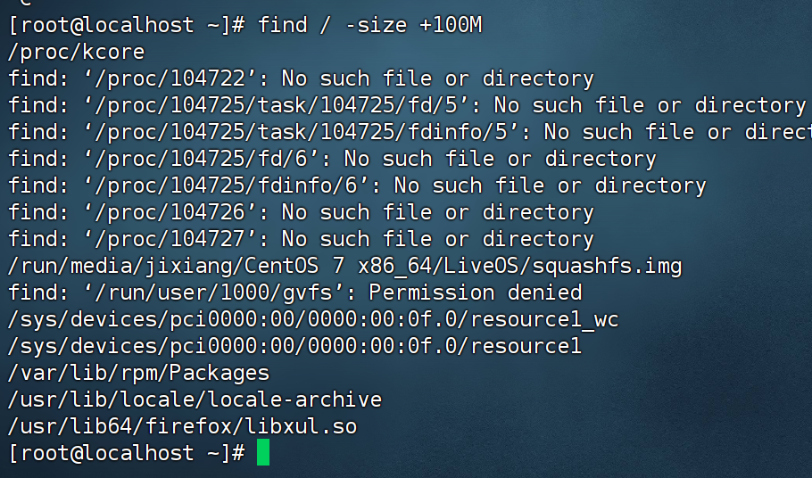

---

### 11-grep-wc-管道符

#### 1.grep命令

可以通过grep命令，从文件中通过关键字过滤文件行

语法：grep [-n] 关键字 文件路径

* 选项-n,可选，表示在结果中显示匹配的行的行号
* 参数，关键字，必填，表示过滤的关键字，带有空格或其它特殊符号，建议使用”“将关键字包围起来
* 参数，文件路径，必填，表示要过滤内容的文件路径，可作为内容输入端口

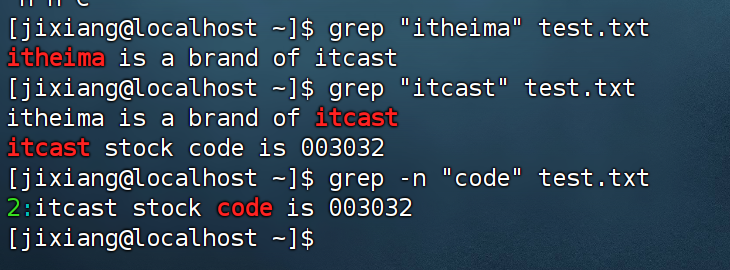

通过管道符，后面可以不通过路径

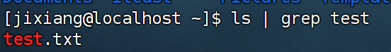

#### 2.wc命令

可以通过wc命令统计文件的行数，单词数量等

语法：wc [-c -m -l -w] 文件路径

* 选项，-c ,统计bytes数量
* 选项，-m,统计字符数量
* 选项，-l，统计行数
* 选项，-w,统计单词数量
* 参数，文件路径，被统计的文件，==可作为内容输入==（可以通过管道符输入）

`wc`（word count）是用于统计行、单词、字节数的命令，它有两种输入方式：

- 方式 1：直接指定文件作为输入

  （最常见）语法：wc -l test.txt，此时wc直接读取test.txt文件的内容并统计行数，无需管道。

- 方式 2：从标准输入（STDIN）读取数据（管道传递的场景）

  如果wc后面不指定文件，它会默认从「标准输入」中读取数据并统计。管道的作用正是把cat的输出（文件内容）送入wc的标准输入，因此wc -l能基于这个数据流统计行数。

  

#### 3.管道符 |

管道符的含义是：将管道符左边命令的结果，作为右边命令的输入

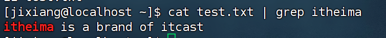

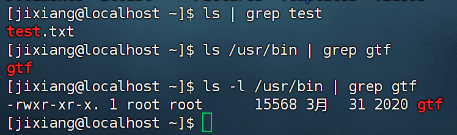

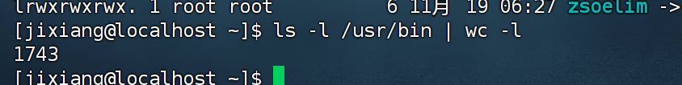

可以嵌套使用|

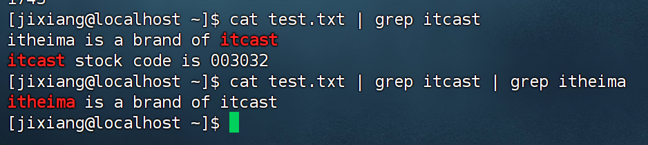

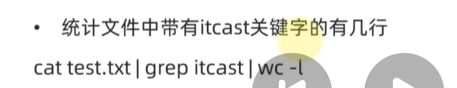

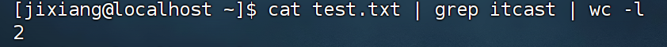

___

### 12-echo-tail-重定向符

#### 1.echo

语法：echo 输出内容

* 无需选项，只有一个参数，表示要输出的内容，复杂内容可以用“”包围

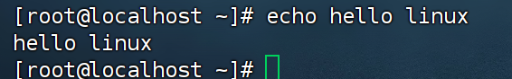

* 在终端上显示：hello linux
* 带有空格或\等特殊符号，建议使用双引号包围
  * 因为不包围的话，空格后很可能容易被识别为参数

反引号`（飘号）

被`包围的内容，会被作为命令执行，而非普通字符

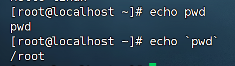

重定向符 >和>>，可以结合echo使用

* 将>左侧命令的==结果==，==覆盖==写入符号右侧指定的文件种
* 将>>左侧命令的结果，==追加==写入到符号右侧指定的文件中

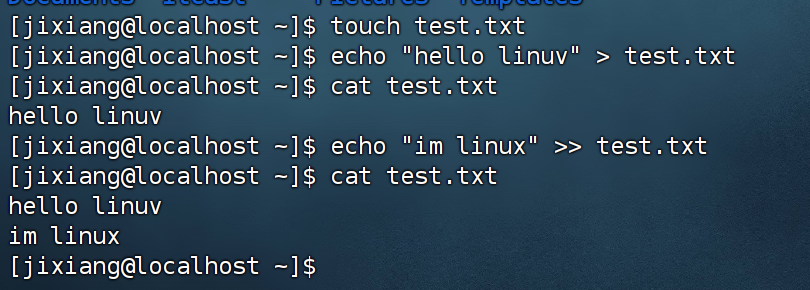

#### 2.tail 命令

可以查看文件尾部内容，追踪文件的最新更改

语法：tail [-f -num] Linux路径

* 参数，Linux路径，表示被追踪的文件路径
* 选项，-f，表示持续跟踪
* 选项，-num,表示，==查看尾部多少行==，不填默认10行

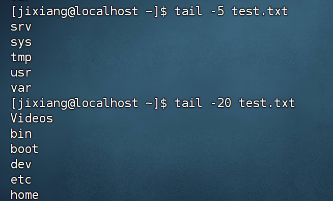

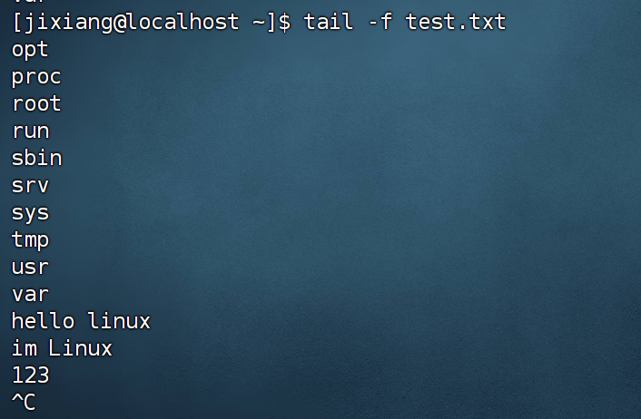

---

### 13-vi编辑器

vi\vim是visual interface的简称，是LInux中最经典的文本编译器

vim是vi的加强版本，兼容vi的所有指令，不仅能编辑文本，而且还具有shell程序编辑的功能，可以不同颜色的字体来辨别语法的正确性，极大方便了程序的设计和编辑性

vi\vim的三种工作模式

命令模式

命令模式下，所敲的按键编辑器都理解为命令，以命令驱动执行不同的功能

输入模式

也就是所谓的编辑模式，插入模式。这个模式下可以对文件内容进行自由编辑。

底线命令模式

以：开始，通常用于文件的保存，退出

命令模式

通过如下命令：

vi 文件路径

vim 文件路径

如果文件路径表示的文件不存在，那么此命令回用于编辑新文件

如果存在，编辑已有文件

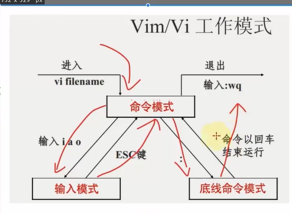

按i键进入输入模式

按ese返回命令模式

按:进入底线命令模式，wq保存并退出

快捷键

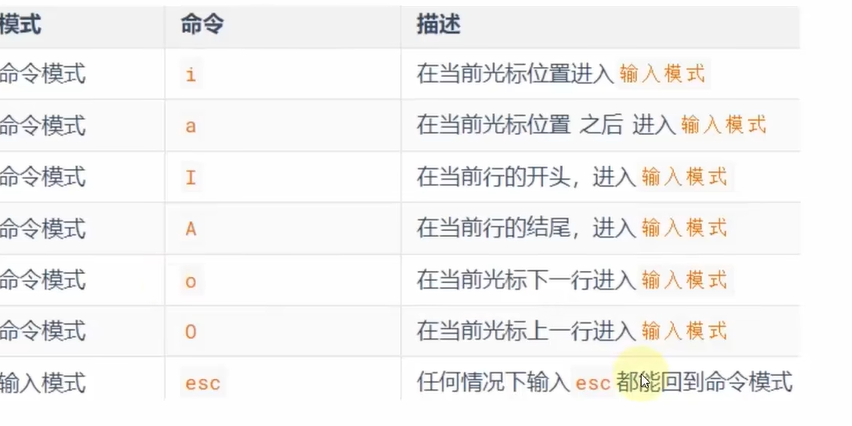

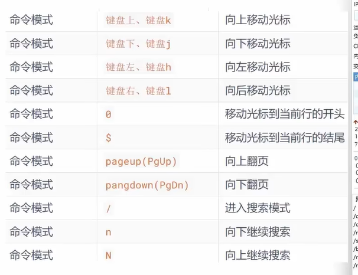

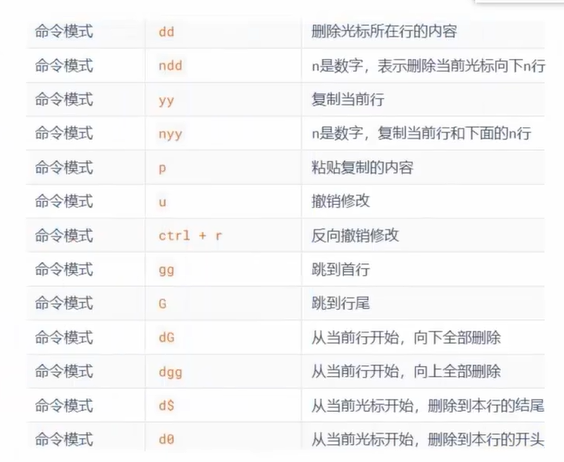

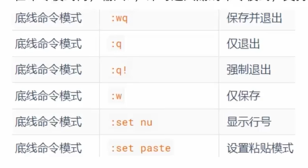

